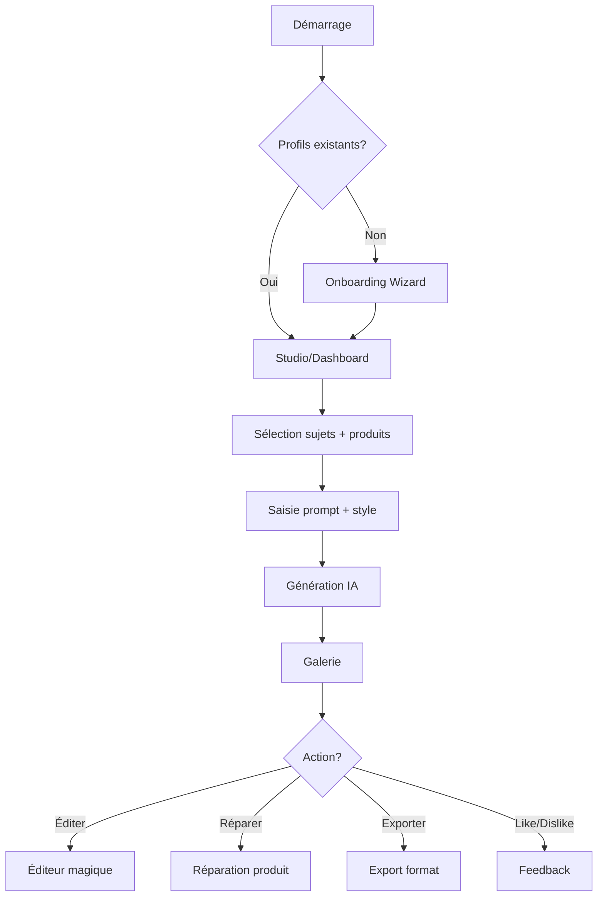

# Studio Photo Pulsee - Vue d'ensemble

## Objectif

Application de création de visuels marketing IA pour la marque **Pulsee Booster**, un produit énergisant sous forme de flacon compte-gouttes. L'application permet de générer des images publicitaires professionnelles en combinant:
- Des photos de personnes (modèles réels ou IA)
- Des photos de produits
- Des prompts créatifs
- Des styles visuels prédéfinis

## Identité visuelle Pulsee

| Élément | Valeur |
|---------|--------|
| **Couleur primaire** | `#0A1628` (bleu marine profond) |
| **Couleur accent** | `#00D4FF` (cyan électrique) |
| **Atmosphère** | Froide, glaciale, "polar mint" |
| **Esthétique** | Premium, pharmaceutique, technique |
| **Effets** | Éclairs, énergie, haute luminosité |

## Stack technique

```
React 19.2.0          # Framework UI
Vite 6.2.0            # Build tool  
TypeScript 5.8        # Langage
@google/genai 1.30.0  # API Gemini
lucide-react          # Icônes
IndexedDB             # Persistence locale
```

## Flux utilisateur principal



## Modèles de données clés

### EntityProfile
```typescript
interface EntityProfile {
  id: string;
  name: string;
  description: string;      // Généré par Gemini
  images: string[];         // Base64
  type: 'PERSON' | 'PRODUCT';
  isAI?: boolean;
  dimensions?: string;
}
```

### GeneratedImage
```typescript
interface GeneratedImage {
  id: string;
  url: string;              // Base64 data URL
  prompt: string;
  mode: GenerationMode;
  styleId?: string;
  feedback?: 'like' | 'dislike';
  generationTime?: number;
}
```

## Points d'intégration

- **Gemini 2.5 Flash** - Analyse d'images, génération de descriptions
- **Gemini 2.5 Flash Image** - Génération et édition d'images
- **IndexedDB** - Persistence locale des profils et galerie
